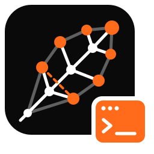

<p align="center"></p>

# oxilite studio

A VS Code development studio for [oxilite](https://oxilitedb.com): SPARQL, Datalog and Cypher,
RDFS/OWL reasoning, SHACL and ShEx validation, over RDF stored in SQLite or Cloudflare D1.

## What it does

- **Project store.** Every RDF file in the workspace loads into a scratch store
  (`.oxilite/studio.sqlite`, git-ignored), one graph per file, or as `oxilite.toml` says.
  Editing a file reloads its graph; reasoning and validation follow.
- **Languages.** SPARQL (`.rq`, `.ru`), Turtle/TriG, Datalog (`.dl`), Cypher (`.cypher`) and
  ShEx (`.shex`): live diagnostics, completion from the store's own vocabulary (predicates by
  use, classes after `a`, missing `PREFIX` lines added for you), hover, go to definition and
  references across files.
- **Run and explain.** `Cmd/Ctrl+Enter` runs a query, a rule program or a Cypher statement;
  `Cmd/Ctrl+Shift+E` shows the SQL it compiles to. Results are a fast table, or a graph.
- **Reasoning.** `none`, `rdfs`, `owlql` or `owl2rl`, plus your Datalog rules, each
  materialized under its own name. The resource view marks inferred statements, and **why?**
  shows the proof down to the lines you wrote.
- **Validation.** SHACL (and ShEx with a shape map) runs in the background; violations appear
  in the Problems panel on the offending line, linked to the shape.
- **Store Explorer.** Graphs, the class hierarchy with asserted and inferred counts,
  properties, files, prefixes, the ontology diagram, and a rules debugger.
- **Tests.** `[[test]]` entries in `oxilite.toml` (query results, SHACL, entailments) run in
  Test Explorer and in CI with `oxilite check`.
- **Connections.** Attach SQLite files, a `wrangler dev` D1 database, or a remote D1 database
  (read-only by default, with billed rows shown for every request). A query file can pin its
  own connection with a first-line comment such as `# oxilite: connection = data/prod.sqlite`.
- **Notebooks** (`.oxnb`) with SPARQL, Datalog and Cypher cells, and a kernel per connection;
  the notebook remembers the one you choose.
- **Agents.** `oxilite mcp` serves query, schema, validate and why as MCP tools; the extension
  registers it, and "Copy MCP Server Config" gives the same for other agents.

## Starting a project

**oxilite: New Project…** scaffolds a folder with a manifest, an ontology, data, a SHACL shape,
rules, a query and two tests, ready for `oxilite check`. It can also create a SQLite database
under `db/` with a query pinned to it. **oxilite: New SQLite Database…** creates an empty database
and makes it the active connection. Both are on the Connections view's title bar.

## A manifest

```toml
reasoning = "owl2rl"

[[graph]]
iri = "https://example.org/g/people"
files = ["data/**/*.ttl"]

[[graph]]
iri = "https://example.org/g/ontology"
files = ["ontology/*.ttl"]
role = "ontology"

[shapes]
files = ["shapes/*.ttl"]

[rules]
files = ["rules/*.dl"]

[[test]]
name = "people have names"
query = "tests/names.rq"
expect = "tests/names.srj"
```

Without a manifest the studio works on any folder: shapes, ontologies and rules are recognized
by their content and extension.

The design, decisions and milestones are in [`lat.md/`](lat.md/).

## Development

The engine runs in `oxilite studio-server`, built from the oxilite repository:

```sh
cargo build --release -p oxilite-cli      # in ../oxilite
npm install && npm run build && npm test  # here; the end-to-end tests use ../oxilite/target/release/oxilite
```

Set `oxilite.server.path` to the built binary, or copy it to `bin/oxilite`, then press F5.
